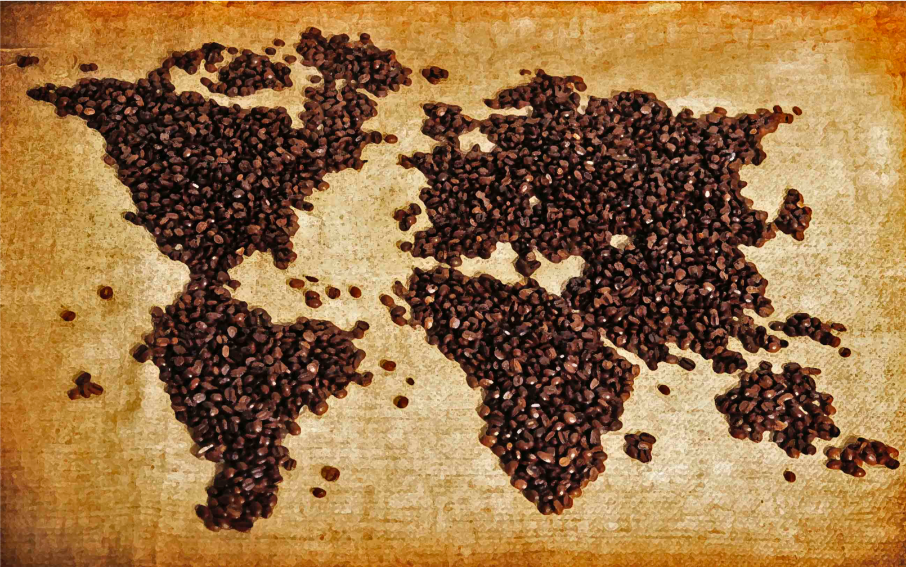
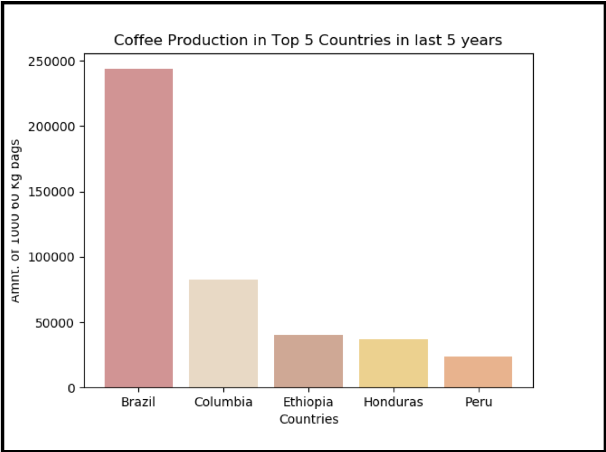

# Project_1_Coffee_Price_Predictors

When examining data related to Arabica coffee beans can we determine factors that influence price?  Using historical data on production factors such as weather and disease and demand factors such as economics we will examine the top five coffee producing and coffee consuming countries and attempt to forecast one year of daily data.

## Coffee Facts

* According to the Global Exchange, there are approximately 25 million farmers in over 50 countries involved in producing coffee

* Seventy percent of coffee beans are Arabica. Although less popular, Robusta is slightly more bitter and has twice as much caffeine.

* Coffee is a popular commodity -> huge global demand

* Coffee commodity is one of the volatile commodities -> weather is major contributing factor.

* Arabica coffee is the world benchmark for coffee futures contracts that trade on the Intercontinental Exchange (ICE).

* Arabica mostly cultivated in Brazil: 40% of world’s total supply 

* Major exporters are : Columbia, Peru, India, Uganda, Ethiopia, Mexico, Cote Ivoire.

## Forcasting Results:

### Ridge Regression Vs. Lasso Regression Vs. Lasso with Outliers Removed

#### Ridge Results: 

Training Adj. R^2 = 0.905

Testing Adj. R^2 = -8.7

MSE = 1353.5

MAE = $31.02
#### Lasso Results: 
Training Adj. R^2 = 0.683

Testing Adj. R^2 = 0.371

MSE = 87.78

MAE = $7.165

#### Deoutliered Lasso:

MAE = $12.84
