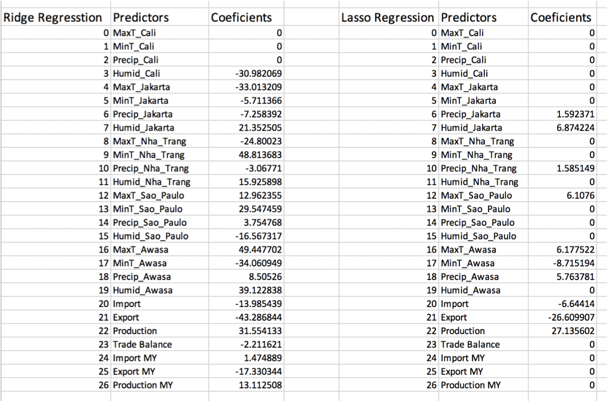
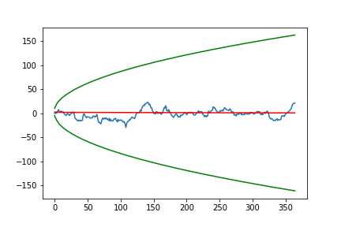
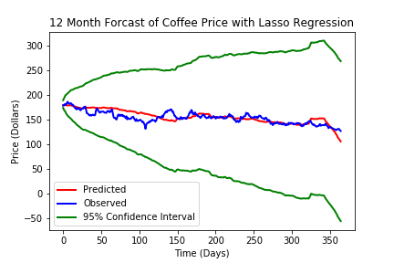
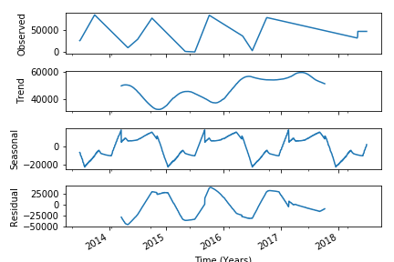

# Project_1_Coffee_Price_Predictors

## Project Goals:
1. Determine the features governing coffee price. 
2. Assess the importance of each feature.
3. Forcast the price of commodity coffee. 

## Project Hypothesis 1:

As weather is a major contributer production affecting both yield and disease, weather would be a major predictor of price.

## Project Hypothesis 2:

Weather alone is not able to forcast the price and so it would need to be combined with production and export/import data.

## Project Hypothesis 3:

As the weather and production data are highly seasonal, Seasonal data decomposed from past data plus scalling from weather and production forcast could be used as features in forcasting the future price.

## Coffee Facts

* According to the Global Exchange, there are approximately 25 million farmers in over 50 countries involved in producing coffee

* Seventy percent of coffee beans are Arabica. Although less popular, Robusta is slightly more bitter and has twice as much caffeine.

* Coffee is a popular commodity -> huge global demand

* Coffee commodity is one of the volatile commodities -> weather is major contributing factor.

* Arabica coffee is the world benchmark for coffee futures contracts that trade on the Intercontinental Exchange (ICE).

* Arabica mostly cultivated in Brazil: 40% of world’s total supply 

* Major exporters are : Columbia, Peru, India, Uganda, Ethiopia, Mexico, Cote Ivoire.

## Forcasting Results:

Weather data alone did not provide addiquate forcasting ability so hypothesis 2 was used to forcast the data.

### Ridge Regression Vs. Lasso Regression Vs. Lasso with Outliers Removed

#### Ridge Results: 

Training Adj. R^2 = 0.905

Testing Adj. R^2 = -8.7

MSE = 1353.5

MAE = $31.02
#### Lasso Results: 
Training Adj. R^2 = 0.683

Testing Adj. R^2 = 0.371

MSE = 87.78

MAE = $7.165

#### Deoutliered Lasso:

MAE = $12.84

## Coeficients for Lasso and Ridge regression:

## Lasso Regression + ARIMA Results:

The final model was made as a combination of the Lasso regression

Mean Absolute Error = $7.165

## Forcasting Procedure and Results:

